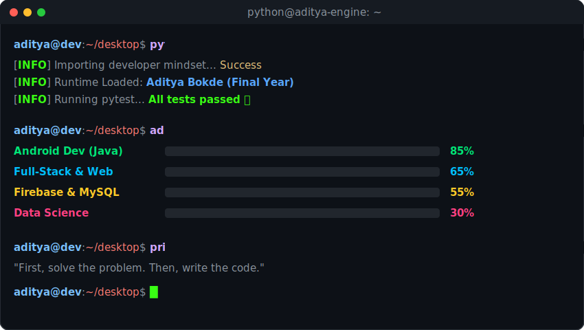

 

&nbsp;

&nbsp;

&nbsp;

 

---

 

## `python projects.py --showcase`

 

&nbsp;&nbsp;

&nbsp;&nbsp;

 

 

---

 

## `python aditya.py --about`
 

	

 

---

 

##  &nbsp; `python tech_stack.py --display`
 

	

 

---

 

## `python -m aditya.games.snake`
 

	

 

---

 

## `print(aditya.get_stats())`
 

	

 

	

 

---
